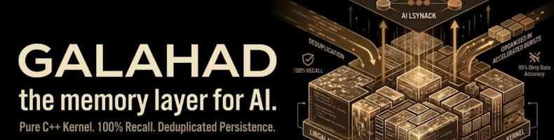
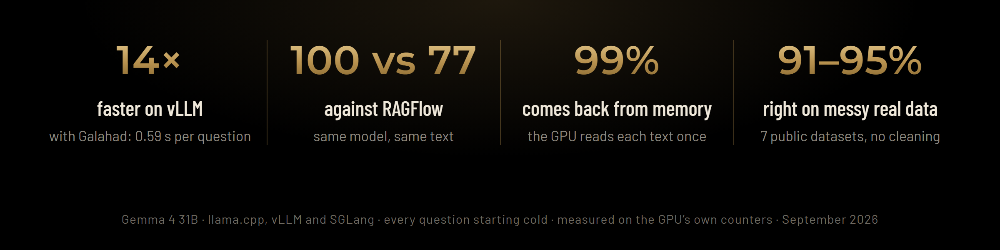

<!-- Copyright (c) 2026 Corbenic AI - Sietse Schelpe. All rights reserved. -->
<p align="center">
  
</p>

<p align="center">
  <a href="https://pypi.org/project/galahad-kv/"></a>
</p>

<p align="center">
  <sub><b>Now live: <code>pip install galahad-kv</code></b></sub>
</p>

<p align="center">
  <a href="https://x.com/CorbenicAI"></a>
  <a href="https://www.linkedin.com/company/corbenic-ai/"></a>
  <a href="https://www.crunchbase.com/organization/corbenic-ai"></a>
  <a href="https://www.corbenic.ai"></a>
</p>

<p align="center">
  <a href="https://arxiv.org/abs/2605.09611"></a>
  <a href="https://arxiv.org/abs/2605.09990"></a>
  <a href="https://arxiv.org/abs/2607.14431"></a>
  <a href="https://arxiv.org/abs/2607.23806"></a>
</p>

<p align="center">
  <a href="https://arxiv.org/search/cs?searchtype=author&query=Schelpe,+S"></a>
  <a href="https://scholar.google.com/citations?user=ZFCcmm0AAAAJ"></a>
  <a href="https://www.semanticscholar.org/author/Sietse-Schelpe/2434939232"></a>
  <a href="https://ui.adsabs.harvard.edu/search/q=author%3A%22Schelpe%2C%20Sietse%22&sort=date%20desc%2C%20bibcode%20desc&p_=0"></a>
  <a href="https://orcid.org/0009-0003-9309-4586"></a>
</p>

<p align="center">
  
  <a href="https://github.com/vllm-project/vllm"></a>
  <a href="https://github.com/sgl-project/sglang"></a>
  <a href="https://github.com/ggml-org/llama.cpp"></a>
</p>

<p align="center">
  
</p>

## What is Galahad?

Galahad is the memory layer for AI. A model reads a text once, and Galahad keeps that reading. When the text is needed again, Galahad gives the reading back, so the GPU never reads the same text twice. Galahad also keeps the documents themselves and finds the part a question is about, so the model reads only what matters.

Galahad has a C++ core and runs inside llama.cpp, vLLM and SGLang.

### Why it matters

- **Don't pay for the same tokens twice.** The tokens a model already processed are
  not processed again. Galahad gives the reading back instead of recomputing it.
  **99.6%** of tokens came back from memory; **14× faster** on vLLM, **0.59 s** per question.
- **Byte-exact, not approximate.** What comes back is identical to what went in: the
  model's exact reading, and your documents stored as exact text. No lossy embedding,
  no "close enough" like a RAG pipeline. **100/100** right vs **77** for RAGFlow.
- **Reads only what matters.** Blaise finds the chapter a question is about, so the
  model reads **670** tokens instead of **9,700**.
- **Read past the context window.** A text far larger than the model's context, up to
  **50 million tokens** measured, is read in parts; each part's reading is saved, and
  the part a question needs is given back. GPU memory stays **flat at 34.1 GB** whether
  the text is 1 million or 50 million tokens.
- **Memory that survives restarts**, encrypted at rest. Key custody depends on the
  configured key provider.

<p align="center">
  
</p>

<p align="center">
  
</p>

## Install

**Free for 1 GPU.**

```bash
pip install galahad-kv
```

Use a dedicated, stable value for `--org`. Licence registration sends this value
to `https://api.corbenic.ai` by default, together with your email, hardware-derived
`node_id` and `wrap_id`, and GPU metadata. Do not reuse an API token, password, or
other credential. This value is distinct from the locally generated `org.key`
file. See the key-provider qualification under [Encryption at rest](#trust-and-cost).

Then activate it (one command for everything):

```bash
galahad free --org "<dedicated-registration-value>" --email you@company.com --accept-non-commercial
galahad doctor          # library loads? licence valid? store writable?
```

- **vLLM:** `vllm serve <model> --kv-transfer-config '{"kv_connector":"GalahadConnector","kv_role":"kv_both"}'`
- **SGLang:** add `--hicache-storage-backend dynamic` with the Galahad backend (see the [wiki](https://github.com/corbenicai/galahad/wiki/Install))
- **Bare / your own code:** link `libgalahad.so` (ships in the wheel)

Linux x86-64, Python 3.10–3.14. On [PyPI](https://pypi.org/project/galahad-kv/).
Full guide: the [wiki](https://github.com/corbenicai/galahad/wiki).

## Key Features

### The core

| | Feature | What it does | Measured |
|---|---|---|---|
| 💾 | **Taliesin** · the memory | Keeps what the model has read. The GPU never reads the same text twice. | **99.6%** of tokens came back from memory |
| 📚 | **Blaise** · the library | Keeps your documents and finds the chapter a question is about. | **100/100** right, 670 tokens read instead of 9,700 |
| 🪟 | **50M-token window** · read past the context limit | A text far past the model's context is read in parts; the window moves over disk, the GPU holds one part. | GPU memory flat **34.1 GB** at 1M and at 50M tokens |
| ⚙️ | **Inside your own program** | The model and Galahad in one C++ program. No server, no Python. | **100/100** right, 0.65 s per question |

<details><summary><b>How it works</b></summary>

- **Taliesin** saves the model's KV cache to disk and restores it. It plugs in as the vLLM KV connector, the SGLang HiCache storage backend, and llama.cpp slot save and restore.
- **Blaise** keeps your documents as exact text and returns the chapter a question is about. Text is stored byte-exact.
- **50M-token window:** a long text is read in parts; each part's reading is saved to disk and the part is dropped from the GPU, so GPU memory stays flat while the window moves over the whole text. The part a question needs is given back and answered from. Nothing to switch on. See the [wiki](https://github.com/corbenicai/galahad/wiki/Performance#very-long-texts).
- **Inside your own program:** llama.cpp is built into the Galahad library; your program calls its C API directly.

</details>

### For agents

| | Feature | What it does | Measured |
|---|---|---|---|
| 🔗 | **Agent connectors** | Records every step of your agent. Never changes what it does. | **0** answers changed, no measurable slowdown |
| 🔁 | **Replay** | Compares a run with a recording and shows the exact step that changed. | One changed word found at **step 0, word 0** |
| 🎯 | **Fault finder** | Says what caused a failure: your code, the model, or a saved reading. | Right cause on all 3 runtimes in **0.001 ms** |
| 🌿 | **Branching** | Many tries from one start, without copying it. | **0.18 ms** instead of 269 ms per branch |
| 🕰️ | **Inspector and rewind** | See what is in memory. Put an agent back to an earlier point. | Rewind passed **27/27** checks |

<details><summary><b>How it works</b></summary>

- **Agent connectors:** one decorator per step, for LangGraph, LangChain, CrewAI or your own loop. Each run becomes a causal graph.
- **Replay:** a pytest plugin. Record once; every CI run compares with the recording, so a prompt change that breaks the agent fails the build.
- **Fault finder:** returns the layer, the rule that decided it and the suspect block. With too little evidence it says "unknown" instead of guessing.
- **Branching:** copy-on-write branches of the KV cache (fork, snapshot, restore, discard). On vLLM and SGLang through a per-request `galahad_branch` flag; snapshots survive a restart.
- **Inspector and rewind:** a local web page and API behind a token, with an audit log. Rewind must be switched on by the host.

</details>

### For many users

| | Feature | What it does | Measured |
|---|---|---|---|
| 🧩 | **Prefix sharing** | A start that many requests share is read once. | **22×** less to compute for 50 agents |
| 📌 | **Pinning** | Keeps what every request needs, such as a system prompt. | Survived **181** evictions |
| 🏢 | **Tenants** | One server, many customers, each kept apart and counted. | Identical questions from two customers stayed apart |

<details><summary><b>How it works</b></summary>

- **Prefix sharing:** the shared start is saved as a chain of chunks, and a lookup finds the longest saved start. It is used only when loading is faster than computing.
- **Pinning:** pinned blocks are skipped when Galahad has to free space.
- **Tenants:** each tenant has its own keyspace, with hits, misses and evictions counted per tenant.

</details>

### Trust and cost

| | Feature | What it does | Measured |
|---|---|---|---|
| 🔐 | **Encryption at rest** | Everything saved is encrypted. A forgotten customer is gone for good. | **0 bytes** readable on disk |
| 🛡️ | **Sanitizer** | Refuses a broken reading before it is saved. | Checked in **0.05 ms** |
| 💰 | **FinOps** | Shows what the memory saved, in GPU time and money. It never guesses. | **746–960** GPU-seconds saved per 100 questions |

<details><summary><b>How it works</b></summary>

- **Encryption at rest:** AES-256-GCM protects saved blocks and the catalogue.
  When the default file licence provider supplies storage keys in 1.31.1,
  without a passphrase override, a licence containing `skw` replaces locally
  generated key material. An issuer retaining that licence and
  the registration `wrap_id` can reconstruct the default storage key and decrypt
  cache files if it obtains them. A locally generated `org.key` does not, by
  itself, establish exclusive customer key custody in this configuration.
  Licences without `skw`, customer-controlled passphrases, and custom key providers
  use different key paths. With a wrong key, the store refuses to open.
- **Sanitizer:** checks for NaN and infinity in the number format the host declares (bf16, f16), and checks the size.
- **FinOps:** uses your GPU price per hour and usage level. Without a price it gives no number and says what is missing.

</details>

<sub>Measured with Gemma 4 31B on llama.cpp, vLLM and SGLang, September 2026.</sub>

## Tested models

Galahad is tested on **30 open models from 10 families**, from 7B to 70B.

| Family | Models |
|---|---|
| **Qwen** | Qwen3 8B · Qwen3 14B · Qwen3 32B · Qwen3.5 9B · Qwen3.8 27B · Qwen3.6 35B-A3B · Qwen3 Coder 30B-A3B |
| **Gemma** | Gemma 4 12B · Gemma 4 26B-A4B · Gemma 4 31B |
| **Mistral** | Ministral 3 8B · Ministral 3 14B · Mistral Small 3.2 24B · Devstral Small 2 24B |
| **GLM** | GLM-4.6V-Flash 9B · GLM-4.7-Flash 30B-A3B |
| **Llama** | Llama 3.1 8B Instruct · Llama 3.3 70B Instruct |
| **DeepSeek** | R1 Distill Qwen 7B · R1 Distill Qwen 14B · R1 Distill Qwen 32B · R1 Distill Llama 8B · R1 Distill Llama 70B · R1-0528-Qwen3-8B |
| **Phi** | Phi-4 14B · Phi-4 Reasoning 14B |
| **GPT-oss** | GPT-oss 20B |
| **Nemotron** | Nemotron 3 Nano 30B-A3B |
| **Olmo** | Olmo 3 7B · Olmo 3 32B |

<sub>&copy; 2026 Corbenic AI - Sietse Schelpe. Patent pending.</sub>
